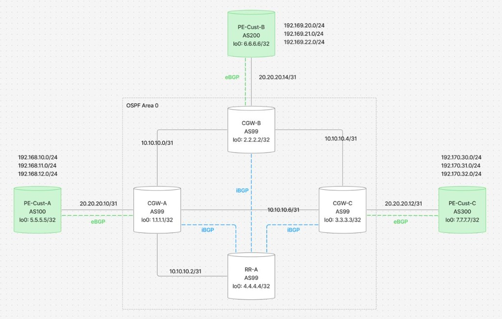

# 📋 Laporan Verifikasi Topologi GNS3 Project "coba"
**Simulasi Jaringan ISP dengan BGP & OSPF**  
**Tanggal:** 12 Februari 2026

---

## Referensi Topologi



---

## Ringkasan Hasil Verifikasi

| # | Requirement | Status |
|---|-------------|--------|
| 1 | Topologi sesuai gambar | ✅ SESUAI |
| 2 | IGP OSPF Area 0 (CGW-A/B/C, RR-A) | ✅ SESUAI |
| 3 | eBGP CGW-x ↔ PE-Cust-x | ✅ SESUAI |
| 4 | iBGP tiap CGW ↔ RR-A | ✅ SESUAI |
| 5 | Semua prefix PE-Cust di routing table CGW via RR-A | ✅ SESUAI |
| 6 | Loopback PE-Cust (5.5.5.5, 6.6.6.6, 7.7.7.7) | ✅ SESUAI |

> **Semua 6 requirement TERPENUHI.**

---

## 1. Arsitektur Jaringan

```
+---------------------------------------------------------------------+
|                        ISP (AS 99)                                  |
|                                                                     |
|              +-----------+                                          |
|              |   RR-A    |  Route Reflector                         |
|              |  4.4.4.4  |  (BGP mirror)                            |
|              +-----+-----+                                          |
|                    | 10.10.10.2/31                                   |
|                    |                                                |
|    +---------------+---------------+                                |
|    |               |               |                                |
|  +-+-------+  +----+------+  +-----+-----+                         |
|  | CGW-A   |--| CGW-B     |--| CGW-C     |  Core Gateway           |
|  | 1.1.1.1 |  | 2.2.2.2   |  | 3.3.3.3   |  Routers               |
|  +-+-------+  +----+------+  +-----+-----+                         |
|    |               |               |          <== OSPF internal     |
+----+---------------+---------------+----------------------------+   |
     | eBGP          | eBGP          | eBGP    <== BGP ke customer    |
     |               |               |                                |
+----+------+  +-----+-----+  +-----+-----+                          |
|PE-Cust-A  |  |PE-Cust-B  |  |PE-Cust-C  |   Customer Edge          |
| lo:5.5.5.5|  | lo:6.6.6.6|  | lo:7.7.7.7|   Routers                |
|  AS 100   |  |  AS 200   |  |  AS 300   |                          |
+-+--+--+---+  +-+--+--+---+  +-+--+--+---+                          |
  |  |  |        |  |  |        |  |  |                               |
 PC1 PC2 PC3   PC4 PC5 PC6   PC7 PC8 PC9      End Users              |
+---------------------------------------------------------------------+
```

### Komponen Jaringan

| Perangkat | Tipe | AS | Loopback0 | Peran |
|-----------|------|-----|-----------|-------|
| CGW-A | Cisco c7200 | 99 | 1.1.1.1/32 | Core Gateway ISP |
| CGW-B | Cisco c7200 | 99 | 2.2.2.2/32 | Core Gateway ISP |
| CGW-C | Cisco c7200 | 99 | 3.3.3.3/32 | Core Gateway ISP |
| RR-A | Cisco c7200 | 99 | 4.4.4.4/32 | Route Reflector |
| PE-Cust-A | Cisco c7200 | 100 | 5.5.5.5/32 | Customer Edge |
| PE-Cust-B | Cisco c7200 | 200 | 6.6.6.6/32 | Customer Edge |
| PE-Cust-C | Cisco c7200 | 300 | 7.7.7.7/32 | Customer Edge |
| PC1-PC9 | VPCS | — | — | End users |

### Peta Link Fisik

| Link | Interface A | IP A | Interface B | IP B |
|------|-------------|------|-------------|------|
| CGW-A ↔ CGW-B | Fa0/0 | 10.10.10.0 | Fa0/0 | 10.10.10.1 |
| CGW-A ↔ RR-A | Fa1/0 | 10.10.10.2 | Fa0/0 | 10.10.10.3 |
| CGW-B ↔ CGW-C | Fa1/0 | 10.10.10.4 | Fa0/0 | 10.10.10.5 |
| CGW-A ↔ CGW-C | Fa2/0 | 10.10.10.6 | Fa1/0 | 10.10.10.7 |
| CGW-A ↔ PE-Cust-A | Fa3/0 | 20.20.20.10 | Fa0/0 | 20.20.20.11 |
| CGW-B ↔ PE-Cust-B | Fa2/0 | 20.20.20.14 | Fa0/0 | 20.20.20.15 |
| CGW-C ↔ PE-Cust-C | Fa2/0 | 20.20.20.12 | Fa0/0 | 20.20.20.13 |

---

## 2. Verifikasi OSPF Area 0

OSPF dijalankan di semua router **di dalam kotak ISP** (CGW-A, CGW-B, CGW-C, RR-A).

### OSPF Konfigurasi

**CGW-A:**
```
router ospf 1
 router-id 1.1.1.1
 network 1.1.1.1 0.0.0.0 area 0
 network 10.10.10.0 0.0.0.1 area 0
 network 10.10.10.2 0.0.0.1 area 0
 network 10.10.10.6 0.0.0.1 area 0
```

**RR-A:**
```
router ospf 1
 router-id 4.4.4.4
 network 4.4.4.4 0.0.0.0 area 0
 network 10.10.10.2 0.0.0.1 area 0
```

### OSPF Neighbor — Hasil Verifikasi

| Router | Neighbor ID | Interface | State |
|--------|-------------|-----------|-------|
| CGW-A | 2.2.2.2 (CGW-B) | Fa0/0 | ✅ FULL |
| CGW-A | 4.4.4.4 (RR-A) | Fa1/0 | ✅ FULL |
| CGW-A | 3.3.3.3 (CGW-C) | Fa2/0 | ✅ FULL |
| CGW-B | 1.1.1.1 (CGW-A) | Fa0/0 | ✅ FULL |
| CGW-B | 3.3.3.3 (CGW-C) | Fa1/0 | ✅ FULL |
| CGW-C | 2.2.2.2 (CGW-B) | Fa0/0 | ✅ FULL |
| CGW-C | 1.1.1.1 (CGW-A) | Fa1/0 | ✅ FULL |
| RR-A | 1.1.1.1 (CGW-A) | Fa0/0 | ✅ FULL |

> ✅ **Semua OSPF adjacency FULL. Area 0 berfungsi dengan baik.**

---

## 3. Verifikasi eBGP (CGW ↔ PE-Cust)

| Session | Local AS | Remote AS | Local IP | Remote IP | Status |
|---------|----------|-----------|----------|-----------|--------|
| CGW-A ↔ PE-Cust-A | 99 | 100 | 20.20.20.10 | 20.20.20.11 | ✅ Established (3 prefixes) |
| CGW-B ↔ PE-Cust-B | 99 | 200 | 20.20.20.14 | 20.20.20.15 | ✅ Established (3 prefixes) |
| CGW-C ↔ PE-Cust-C | 99 | 300 | 20.20.20.12 | 20.20.20.13 | ✅ Established (3 prefixes) |

### Prefix yang di-advertise setiap Customer

| Customer | Prefix 1 | Prefix 2 | Prefix 3 |
|----------|----------|----------|----------|
| PE-Cust-A (AS 100) | 192.168.10.0/24 | 192.168.11.0/24 | 192.168.12.0/24 |
| PE-Cust-B (AS 200) | 192.169.20.0/24 | 192.169.21.0/24 | 192.169.22.0/24 |
| PE-Cust-C (AS 300) | 192.170.30.0/24 | 192.170.31.0/24 | 192.170.32.0/24 |

> ✅ **Semua 3 sesi eBGP aktif, masing-masing menerima 3 prefix.**

---

## 4. Verifikasi iBGP (CGW ↔ RR-A)

| Session | Neighbor | update-source | route-reflector-client | Status |
|---------|----------|---------------|----------------------|--------|
| CGW-A ↔ RR-A | 4.4.4.4 | Loopback0 ✅ | ✅ (di RR-A) | ✅ Established (6 prefixes) |
| CGW-B ↔ RR-A | 4.4.4.4 | Loopback0 ✅ | ✅ (di RR-A) | ✅ Established (6 prefixes) |
| CGW-C ↔ RR-A | 4.4.4.4 | Loopback0 ✅ | ✅ (di RR-A) | ✅ Established (6 prefixes) |

### RR-A BGP Config (Route Reflector)

```
router bgp 99
 bgp router-id 4.4.4.4
 neighbor 1.1.1.1 remote-as 99
 neighbor 1.1.1.1 update-source Loopback0
 neighbor 1.1.1.1 route-reflector-client    ← reflect ke CGW-A
 neighbor 1.1.1.1 next-hop-self
 neighbor 2.2.2.2 remote-as 99
 neighbor 2.2.2.2 update-source Loopback0
 neighbor 2.2.2.2 route-reflector-client    ← reflect ke CGW-B
 neighbor 2.2.2.2 next-hop-self
 neighbor 3.3.3.3 remote-as 99
 neighbor 3.3.3.3 update-source Loopback0
 neighbor 3.3.3.3 route-reflector-client    ← reflect ke CGW-C
 neighbor 3.3.3.3 next-hop-self
```

> ✅ **Semua 3 sesi iBGP aktif via Loopback. RR-A berfungsi sebagai Route Reflector.**

---

## 5. Verifikasi Routing Table — Semua Prefix di Setiap CGW

### CGW-A (`show ip route bgp`)

| Prefix | Next-Hop | Sumber | AD/Metric |
|--------|----------|--------|-----------|
| 192.168.10.0/24 | 20.20.20.11 | eBGP langsung (PE-Cust-A) | 20/0 |
| 192.168.11.0/24 | 20.20.20.11 | eBGP langsung (PE-Cust-A) | 20/0 |
| 192.168.12.0/24 | 20.20.20.11 | eBGP langsung (PE-Cust-A) | 20/0 |
| 192.169.20.0/24 | **2.2.2.2** | iBGP via RR-A ✅ | 200/0 |
| 192.169.21.0/24 | **2.2.2.2** | iBGP via RR-A ✅ | 200/0 |
| 192.169.22.0/24 | **2.2.2.2** | iBGP via RR-A ✅ | 200/0 |
| 192.170.30.0/24 | **3.3.3.3** | iBGP via RR-A ✅ | 200/0 |
| 192.170.31.0/24 | **3.3.3.3** | iBGP via RR-A ✅ | 200/0 |
| 192.170.32.0/24 | **3.3.3.3** | iBGP via RR-A ✅ | 200/0 |

### CGW-B (`show ip route bgp`)

| Prefix | Next-Hop | Sumber | AD/Metric |
|--------|----------|--------|-----------|
| 192.168.10.0/24 | **1.1.1.1** | iBGP via RR-A ✅ | 200/0 |
| 192.168.11.0/24 | **1.1.1.1** | iBGP via RR-A ✅ | 200/0 |
| 192.168.12.0/24 | **1.1.1.1** | iBGP via RR-A ✅ | 200/0 |
| 192.169.20.0/24 | 20.20.20.15 | eBGP langsung (PE-Cust-B) | 20/0 |
| 192.169.21.0/24 | 20.20.20.15 | eBGP langsung (PE-Cust-B) | 20/0 |
| 192.169.22.0/24 | 20.20.20.15 | eBGP langsung (PE-Cust-B) | 20/0 |
| 192.170.30.0/24 | **3.3.3.3** | iBGP via RR-A ✅ | 200/0 |
| 192.170.31.0/24 | **3.3.3.3** | iBGP via RR-A ✅ | 200/0 |
| 192.170.32.0/24 | **3.3.3.3** | iBGP via RR-A ✅ | 200/0 |

### CGW-C (`show ip route bgp`)

| Prefix | Next-Hop | Sumber | AD/Metric |
|--------|----------|--------|-----------|
| 192.168.10.0/24 | **1.1.1.1** | iBGP via RR-A ✅ | 200/0 |
| 192.168.11.0/24 | **1.1.1.1** | iBGP via RR-A ✅ | 200/0 |
| 192.168.12.0/24 | **1.1.1.1** | iBGP via RR-A ✅ | 200/0 |
| 192.169.20.0/24 | **2.2.2.2** | iBGP via RR-A ✅ | 200/0 |
| 192.169.21.0/24 | **2.2.2.2** | iBGP via RR-A ✅ | 200/0 |
| 192.169.22.0/24 | **2.2.2.2** | iBGP via RR-A ✅ | 200/0 |
| 192.170.30.0/24 | 20.20.20.13 | eBGP langsung (PE-Cust-C) | 20/0 |
| 192.170.31.0/24 | 20.20.20.13 | eBGP langsung (PE-Cust-C) | 20/0 |
| 192.170.32.0/24 | 20.20.20.13 | eBGP langsung (PE-Cust-C) | 20/0 |

> ✅ **Setiap CGW memiliki SEMUA 9 prefix customer.** Prefix dari customer lain diterima via iBGP (AD=200) dengan next-hop loopback CGW terkait — artinya RR-A sukses merefleksikan rute.

---

## 6. Step-by-Step — Bagaimana Topologi Ini Bekerja

### Langkah 1: OSPF Membangun Fondasi
OSPF Area 0 diaktifkan di semua router ISP. Setiap router mengiklankan loopback dan link backbone-nya → semua router ISP saling tahu jalan ke setiap loopback (1.1.1.1, 2.2.2.2, 3.3.3.3, 4.4.4.4).

### Langkah 2: eBGP Menerima Rute Customer
Setiap CGW menerima prefix LAN customer-nya melalui eBGP:
- CGW-A ← 192.168.10-12.0/24 dari PE-Cust-A (AS 100)
- CGW-B ← 192.169.20-22.0/24 dari PE-Cust-B (AS 200)
- CGW-C ← 192.170.30-32.0/24 dari PE-Cust-C (AS 300)

### Langkah 3: CGW Mengirim Rute ke RR-A via iBGP
Setiap CGW mengirimkan rute customer ke RR-A menggunakan iBGP (via loopback, `update-source Loopback0`). `next-hop-self` mengubah next-hop menjadi loopback CGW agar reachable via OSPF.

### Langkah 4: RR-A Merefleksikan Rute
RR-A menerima rute dari semua CGW, lalu **merefleksikan** ke CGW lainnya berkat konfigurasi `route-reflector-client`. Tanpa ini, iBGP tidak boleh meneruskan rute dari satu iBGP peer ke iBGP peer lain.

### Langkah 5: Semua CGW Punya Rute Lengkap
Hasil akhir: setiap CGW punya rute ke **semua 9 prefix customer** — 3 dari eBGP langsung, 6 dari iBGP via RR-A.

### Alur Data: PC1 → PC7

```
PC1 (192.168.10.x)
  → PE-Cust-A (gateway 192.168.10.1)
    → CGW-A (20.20.20.10, via eBGP AS99)
      → CGW-C (via OSPF, next-hop 3.3.3.3)
        → PE-Cust-C (20.20.20.13, via eBGP AS300)
          → PC7 (192.170.30.x) ✅
```

---

## Kesimpulan

**Topologi project "coba" sudah SESUAI dengan semua 6 requirement.** Routing bekerja sempurna — setiap customer bisa berkomunikasi melalui backbone ISP berkat kombinasi OSPF (IGP), eBGP (customer ↔ ISP), dan iBGP + Route Reflector (distribusi rute antar CGW).

### Ringkasan Protokol

| Protokol | Fungsi | Di Mana |
|----------|--------|---------|
| OSPF Area 0 | Routing internal ISP backbone | CGW-A, CGW-B, CGW-C, RR-A |
| iBGP AS 99 | Distribusi rute customer dalam ISP | CGW-A/B/C ↔ RR-A |
| eBGP | Pertukaran rute ISP ↔ customer | CGW ↔ PE-Cust |

| AS Number | Pemilik | Router |
|-----------|---------|--------|
| 99 | ISP | CGW-A, CGW-B, CGW-C, RR-A |
| 100 | Customer A | PE-Cust-A |
| 200 | Customer B | PE-Cust-B |
| 300 | Customer C | PE-Cust-C |

---

*Dibuat otomatis dari verifikasi GNS3 project "coba" — 12 Februari 2026*
